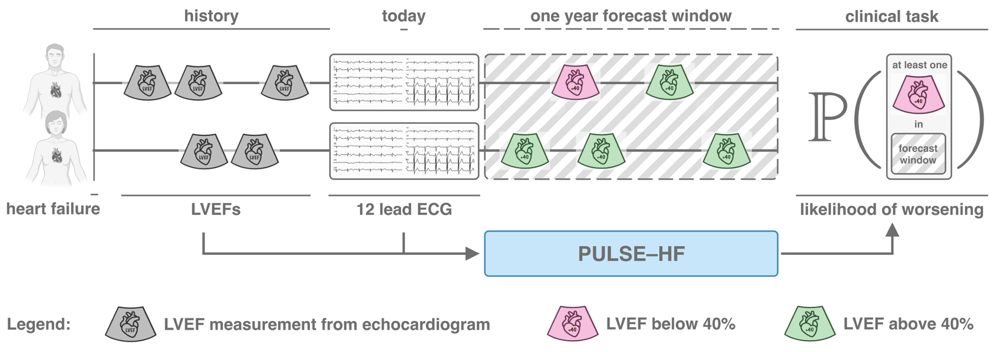

# 🫀 PULSE–HF: Predicting Worsening Left Ventricular Function in Heart Failure Patients from ECGs

[](https://creativecommons.org/licenses/by/4.0/)
[](https://www.medrxiv.org/content/10.1101/2025.04.13.25325744v1)

**PULSE–HF** is a deep learning framework that forecasts whether a patient’s **left ventricular ejection fraction (LVEF)** will decline below **40% within one year** based on a **standard 12-lead ECG** and **prior LVEF measurements**. It is designed specifically for patients with a history of heart failure.


---

## 📄 Read the Paper

> 📘 **Preprint Available**:  
> **"Forecasting left ventricular systolic dysfunction in heart failure with artificial intelligence"**  
> by Payal Chandak et al., 2025  
>  
> 🧾 [Read the preprint on medRxiv →](https://www.medrxiv.org/content/10.1101/2025.04.13.25325744v1)

---

## 🧠 Why PULSE-HF?

Heart failure is a major public health burden, with five-year mortality rates exceeding 50%. In heart failure patients with preserved ejection fraction, the ability to anticipate worsening systolic function—before symptoms emerge—opens new doors for:

- 🕒 **Early intervention**
- 📉 **Improved prognostication**
- 💊 **Timely therapy initiation**
- 🏥 **Optimized echocardiogram scheduling**

> ⚠️ Existing EHR-based models achieve only 54–68% AUROC for this task. PULSE-HF hits **~92% AUROC** across multiple institutions.

---

## 🔍 What Does PULSE-HF Do?

PULSE–HF forecasts whether a patient's **LVEF will fall below 40%** within **1 year** after an ECG is taken. It does this by combining:

- 🖥️ **Raw 12-lead ECG waveform data**
- 📊 **History of past LVEF values**

It also includes a **Lead I version** that performs comparably—ideal for **wearables** or **home-based monitoring**.

---

## 📜 Cite us

If you find this work helpful, please reference:
```
@article{chandak2025pulsehf,
  title={Forecasting left ventricular systolic dysfunction in heart failure with artificial intelligence},
  author={Chandak, Payal and Kyereme-Tuah, Abena and Hung, Judy and Gaggin, Hanna and Kohane, Isaac S. and Stultz, Collin M.},
  journal={medRxiv},
  year={2025},
  doi={10.1101/2025.04.13.25325744},
}
```
